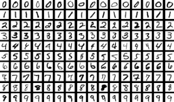

# MNIST Digit Recognition using TensorFlow

 
This repository demonstrates the implementation of a digit recognition model using the MNIST dataset and TensorFlow. The goal of this project is to build and train a deep neural network that can accurately classify handwritten digits.

## Dataset

The MNIST dataset is a widely used dataset in the field of machine learning. It consists of 28x28 grayscale images of handwritten digits (0 to 9) and their corresponding labels.

## Model Architecture

The digit recognition model is built using TensorFlow, a popular deep learning framework. The model architecture consists of the following layers:

1. Input Layer: Flattened 28x28 pixel image.
2. Hidden Layers: Two fully connected hidden layers with ReLU activation functions.
3. Output Layer: Fully connected output layer with 10 units (one for each digit) and softmax activation function.

## Model Training

1. Data Preprocessing: The pixel values of the images are normalized to the range [0, 1] and the labels are one-hot encoded.
2. Model Compilation: The model is compiled with appropriate loss function (categorical cross-entropy) and optimizer (Adam).
3. Model Training: The model is trained using the training data and validated using the validation data.
4. Model Evaluation: The accuracy of the trained model is evaluated using the test data.

## Getting Started

1. Clone this repository to your local machine.
2. Ensure you have TensorFlow and any required dependencies installed.
3. Open the provided Jupyter Notebook or Python script.
4. Run the code cells to train the model and evaluate its performance.

## Results

After training the model, you can expect to achieve an accuracy of around 98% on the MNIST test dataset. You can further fine-tune the model's hyperparameters and architecture to potentially improve its performance.

## Acknowledgements

The MNIST dataset is sourced from the TensorFlow datasets module. This project is intended for educational purposes and to showcase the implementation of a digit recognition model using TensorFlow.

## License

This project is licensed under the MIT License - see the [LICENSE](LICENSE) file for details.
